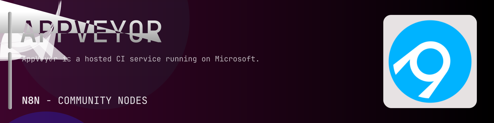

# @n8n-dev/n8n-nodes-appveyor



[](https://www.npmjs.com/package/@n8n-dev/n8n-nodes-appveyor)
[](https://opensource.org/licenses/MIT)

---

**Stop writing appveyor API integrations by hand.**

Every time you connect n8n to appveyor, you waste hours mapping endpoints, defining parameters, and debugging schemas. You copy-paste from docs, fix edge cases, and pray nothing breaks.

**What if connecting n8n to appveyor took 5 minutes, not half a day?**

This node gives you **7+ resources** out of the box: **Collaborator**, **Role**, **User**, **Build**, **Project**, and 2 more: with full CRUD operations, typed parameters, and zero manual configuration.

---

## What You Get

- **Zero boilerplate**: Resources, operations, and fields are pre-configured and ready to use
- **Full CRUD**: Create, read, update, and delete support where the API allows it
- **Typed parameters**: No more guessing field types
- **Built-in auth**: API key authentication, ready to go
- **Declarative**: Native n8n performance, no custom execute() overhead

---

## Install

```bash
npm install @n8n-dev/n8n-nodes-appveyor
```

**Or in n8n:**
1. **Settings → Community Nodes → Install**
2. Search: `@n8n-dev/n8n-nodes-appveyor`
3. Click **Install**

---

## Quick Start

1. Install the node (above)
2. Add credentials: **appveyor API** → paste your API key
3. Drag the **appveyor** node into your workflow
4. Pick a resource → pick an operation → done.

That's it. No configuration files. No code. It just works.

---

## Resources

<details>
<summary><b>Collaborator</b> (3 operations)</summary>

- Get collaborators
- Delete collaborator
- Get collaborator

</details>

<details>
<summary><b>Role</b> (3 operations)</summary>

- Get roles
- Delete role
- Get role

</details>

<details>
<summary><b>User</b> (5 operations)</summary>

- Get users
- Get user invitations
- Delete Cancel user invitation
- Delete user
- Get user

</details>

<details>
<summary><b>Build</b> (4 operations)</summary>

- Get build artifacts
- Get Download build artifact
- Get Download build log
- Delete Cancel build

</details>

<details>
<summary><b>Project</b> (11 operations)</summary>

- Get projects
- Delete project
- Get project last build
- Get last successful build artifact
- Get project last branch build
- Get project build by version
- Delete project build cache
- Get project deployments
- Get project settings
- Get project environment variables
- Get project settings in YAML

</details>

<details>
<summary><b>Deployment</b> (1 operations)</summary>

- Get deployment

</details>

<details>
<summary><b>Environment</b> (4 operations)</summary>

- Get environments
- Delete environment
- Get environment deployments
- Get environment settings

</details>

---

## Why This Node?

**Without this node:**
- Hours of manual API integration
- Copy-pasting from appveyor docs
- Debugging auth, pagination, error handling
- Maintaining your own client code

**With this node:**
- Install → configure → use. 5 minutes.
- Auto-generated from the official appveyor OpenAPI spec
- Always up to date when the API changes
- Native n8n performance

---

## Auto-Generated
This node was auto-generated from the official **appveyor** OpenAPI specification using
[@n8n-dev/n8n-openapi-node-ultimate](https://github.com/kelvinzer0/n8n-openapi-node-ultimate),
then validated against the live API so you get accurate types and real parameters, not guesswork.

When the appveyor API updates, this node updates too.

---


## License

MIT © [kelvinzer0](https://github.com/n8n-code)
